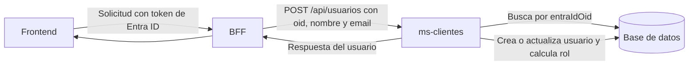

# ms-clientes

Microservicio Spring Boot para gestionar usuarios sincronizados desde Entra ID a través del flujo front -> BFF -> MS.

## Flujo del microservicio



### Qué hace

- Recibe desde un consumidor HTTP, normalmente el BFF, los datos del usuario en `POST /api/usuarios`.
- Usa el `oid` de Entra ID como identificador único del usuario.
- Busca el usuario por OID y aplica aprovisionamiento just-in-time:
  - Si no existe, lo crea.
  - Si existe, actualiza su nombre, email y rol.
- Calcula el rol en el servidor comparando el OID recibido con `APP_ADMIN_OID`:
  - OID configurado: `admin`.
  - Cualquier otro OID: `user`.
- Permite consultar un usuario existente mediante `GET /api/usuarios/{oid}`.
- Persiste los datos mediante JPA en la base de datos configurada.

### Qué no hace

- No inicia sesión en Entra ID ni valida directamente tokens, credenciales o permisos.
- No obtiene el OID consultando Entra ID. El OID debe venir en la solicitud recibida, idealmente reenviada por el BFF después de validar el token.
- No llama al BFF ni a Entra ID desde este código; expone una API para que el BFF la consuma.
- No confía en el campo `rol` del request para asignar privilegios. Ese campo se conserva por compatibilidad del contrato, pero el rol final se calcula a partir del OID.
- No contiene lógica de frontend, emisión de tokens ni autorización por endpoint.

### Responsabilidad del BFF

El BFF debe recibir la solicitud del frontend, validar el token de Entra ID y extraer los claims necesarios, incluido el `oid`. Luego debe enviar esos datos a este microservicio mediante `POST /api/usuarios`. La implementación actual de este repositorio no demuestra ni reemplaza esa validación.

### Persistencia actual

Por defecto se utiliza H2 en memoria (`jdbc:h2:mem:msclientes`). Los usuarios se pierden al reiniciar la aplicación, salvo que se configure otra base de datos mediante las variables de conexión.

## Cambios de hoy

- Se eliminó la capa antigua de `clientes` y el proyecto quedó centrado en `usuarios`.
- Se agregó persistencia JPA con H2 en memoria.
- Se creó la entidad `Usuario` con estos campos:
  - `id` autogenerado
  - `entraIdOid` único y no nulo
  - `nombre`
  - `email`
  - `rol`
  - `fechaRegistro`
- Se agregó `UsuarioRepository` con búsqueda por OID de Entra ID.
- Se agregó `UsuarioService` con lógica de sincronización tipo just-in-time provisioning.
- Se agregó `UsuarioController` expuesto en `/api/usuarios`.
- Se agregó el rol `admin` / `user`.

## Reglas de negocio del rol

- El OID `32a7ca6e-5a16-4dd0-9cc5-7ad24350eca3` se asigna como `admin`.
- Cualquier otro usuario se guarda como `user`.
- El rol también tiene valor por defecto `user` en la entidad para evitar nulos.

> Nota: el OID admin no está embebido solo como texto en el código. Se resuelve desde la propiedad `app.admin-oid` y tiene un valor por defecto en `application.yml`.

## Endpoints

### GET `/api/usuarios/{oid}`
Busca un usuario por OID de Entra ID.

### POST `/api/usuarios`
Crea o actualiza un usuario con este payload:

```json
{
  "oid": "32a7ca6e-5a16-4dd0-9cc5-7ad24350eca3",
  "nombre": "Nombre Apellido",
  "email": "usuario@correo.com",
  "rol": "admin"
}
```

El campo `rol` se conserva en el contrato actual, pero la asignación final del rol la resuelve el servicio según el OID configurado.

## Variables de entorno

Puedes arrancar el proyecto sin tocar archivos usando estas variables:

- `SERVER_PORT`: puerto de la aplicación.
- `SPRING_DATASOURCE_URL`: URL JDBC de la base de datos.
- `SPRING_DATASOURCE_USERNAME`: usuario de la base de datos.
- `SPRING_DATASOURCE_PASSWORD`: contraseña de la base de datos.
- `SPRING_DATASOURCE_DRIVER_CLASS_NAME`: driver JDBC.
- `APP_ADMIN_OID`: OID de Entra ID que debe quedar como `admin`.

## Arranque local

### Opción 1: usar valores por defecto

```bash
bash ./mvnw spring-boot:run
```

### Opción 2: arrancar con variables de entorno

```bash
export SERVER_PORT=8083
export SPRING_DATASOURCE_URL='jdbc:h2:mem:msclientes;DB_CLOSE_DELAY=-1;DB_CLOSE_ON_EXIT=FALSE'
export SPRING_DATASOURCE_USERNAME=sa
export SPRING_DATASOURCE_PASSWORD=
export SPRING_DATASOURCE_DRIVER_CLASS_NAME=org.h2.Driver
export APP_ADMIN_OID=32a7ca6e-5a16-4dd0-9cc5-7ad24350eca3

bash ./mvnw spring-boot:run
```

### Opción 3: una sola línea

```bash
SERVER_PORT=8083 \
SPRING_DATASOURCE_URL='jdbc:h2:mem:msclientes;DB_CLOSE_DELAY=-1;DB_CLOSE_ON_EXIT=FALSE' \
SPRING_DATASOURCE_USERNAME=sa \
SPRING_DATASOURCE_PASSWORD= \
SPRING_DATASOURCE_DRIVER_CLASS_NAME=org.h2.Driver \
APP_ADMIN_OID=32a7ca6e-5a16-4dd0-9cc5-7ad24350eca3 \
bash ./mvnw spring-boot:run
```

## Verificación

- El proyecto compila correctamente con `bash ./mvnw -q -DskipTests compile`.
- La aplicación levanta correctamente con H2 en memoria.
